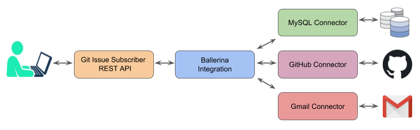

# Git Issue Subscriber
Git Issue Subscriber allow users to subscribe to repositories and get notification mail when a new issue has been posted. 
People who are interested can subscribe to get notification when an issue is posted to a GitHub repository via the application. 
Subscribers receive a gmail notification if an issue is posted on the repository. 
Also when a user subscribe to a repository, he will receive an email.



### Getting started

* Clone the repository by running the following command
```shell
git clone https://github.com/AmaliMatharaarachchi/Git-Issue-Subscriber.git
```

* Initialize the ballerina project.
```shell
ballerina init
```
* Create a file called `ballerina.conf` and include the following configurations*
```shell

GITHUB_TOKEN="your github token"

HOST= "localhost"
PASSWORD= "your mysql connection password"
NAME= "your mysql database name"
USERNAME= "your mysql connection username"
PORT= "3306"

EMAIL="your_email@example.com"
CLIENT_ID="your gmail client id"
ACCESS_TOKEN="your gmail access token"
CLIENT_SECRET="your gmail client secret"
REFRESH_TOKEN="your gmail refresh token"

```
 
### Endpoints

* Subscribe to Github repository
##### Example 1
Request

```shell
curl -X POST \
  http://localhost:3306/git-issue-subscriber/subscribe \
  -H 'Content-Type: application/json' \
  -d '{
    "repositoryOwner": "AmaliMatharaarachchi",
    "repositoryName": "scrappy",
    "email": "email@example.com"
}'
```
Response

```shell
{
    "status" = 200
}
```
##### Example 2
Request
```shell
curl -X POST \
  http://localhost:3306/git-issue-subscriber/subscribe \
  -H 'Content-Type: application/json' \
  -d '{
    "repositoryOwner": "AmaliMatharaarachchi",
    "repositoryName": "nonexist",
    "email": "email@example.com"
}'
```
Response

```shell
{
    "err" : "Repository with name: AmaliMatharaarachchi/nonexist is not found", 
    "status" : 502
}
```
* Post a Git Issue
##### Example 
Request

```shell
curl -X POST \
  http://localhost:9090/git-issue-subscriber/issue \
  -H 'Content-Type: application/json' \
  -d '{
	 "repositoryOwner": "AmaliMatharaarachchi",
     "repositoryName": "scrappy",
     "issueTitle": "Issue Title",
     "issueContent": "This is issue content"
}'
```
Response

```shell
{
    "status": 200
}
```
* Testing
```shell
ballerina test git-issue-subscriber/

```

*For more details, please follow https://github.com/wso2-ballerina/module-github, https://github.com/wso2-ballerina/module-gmail and https://ballerina.io/learn/api-docs/ballerina/mysql.html 
***
